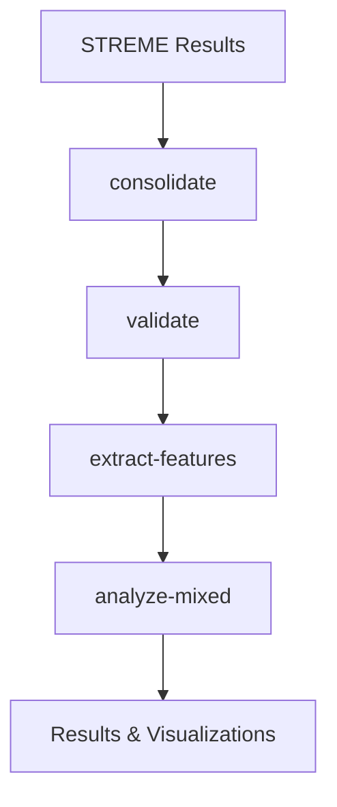

# Documentation Index

This directory contains all documentation for the STREME Analysis Pipeline.

## 📚 Documentation Overview

### 🚀 Getting Started
- **[README.md](../README.md)** - Main project overview and quick start
- **[GETTING_STARTED.md](./GETTING_STARTED.md)** - Detailed setup and first steps
- **[requirements.txt](../requirements.txt)** - Python dependencies

### 📖 User Guides
- **[COMPLETE_WORKFLOW.md](./COMPLETE_WORKFLOW.md)** - Complete analysis workflow
- **[COMPREHENSIVE_REGULATORY_ANALYSIS.md](./COMPREHENSIVE_REGULATORY_ANALYSIS.md)** - Advanced regulatory analysis guide
- **[STATISTICAL_MODELING_GUIDE.md](./STATISTICAL_MODELING_GUIDE.md)** - Statistical approaches explanation

### 📊 Reference Materials
- **[OUTPUT_COLUMNS_GUIDE.md](./OUTPUT_COLUMNS_GUIDE.md)** - Output format specifications

## 🎯 Quick Navigation

### For New Users
1. Read [README.md](../README.md) for project overview
2. Follow [GETTING_STARTED.md](./GETTING_STARTED.md) for setup
3. Try the examples in [COMPLETE_WORKFLOW.md](./COMPLETE_WORKFLOW.md)

### For Advanced Analysis
1. Review [STATISTICAL_MODELING_GUIDE.md](./STATISTICAL_MODELING_GUIDE.md) for modeling approaches
2. Follow [COMPREHENSIVE_REGULATORY_ANALYSIS.md](./COMPREHENSIVE_REGULATORY_ANALYSIS.md) for advanced features
3. Reference [OUTPUT_COLUMNS_GUIDE.md](./OUTPUT_COLUMNS_GUIDE.md) for output interpretation

### For Developers
- Check `../cli_tools/` for tool implementations
- See `../pipelines/` for main orchestration logic
- Review `../archive/` for alternative implementations

## 🔧 Command Reference

```bash
# Quick help
./bin/streme-parser --help
./bin/streme-parser <command> --help

# Main commands
./bin/streme-parser consolidate     # Consolidate motifs
./bin/streme-parser extract-features # Extract ML features  
./bin/streme-parser analyze-mixed   # Mixed-effects analysis (RECOMMENDED)
./bin/streme-parser full            # Complete pipeline
```

## 🎯 Recommended Analysis Flow



## 📈 Statistical Approaches

The pipeline implements multiple statistical approaches:

- **Mixed-Effects Models** (recommended): Gold standard in regulatory genomics
- **Gene-by-Gene Analysis**: Individual gene modeling
- **Hierarchical Models**: Groups similar genes for shared effects

See [STATISTICAL_MODELING_GUIDE.md](./STATISTICAL_MODELING_GUIDE.md) for detailed explanations.

---

**Need help?** Check the specific guide for your use case above, or run any command with `--help`.